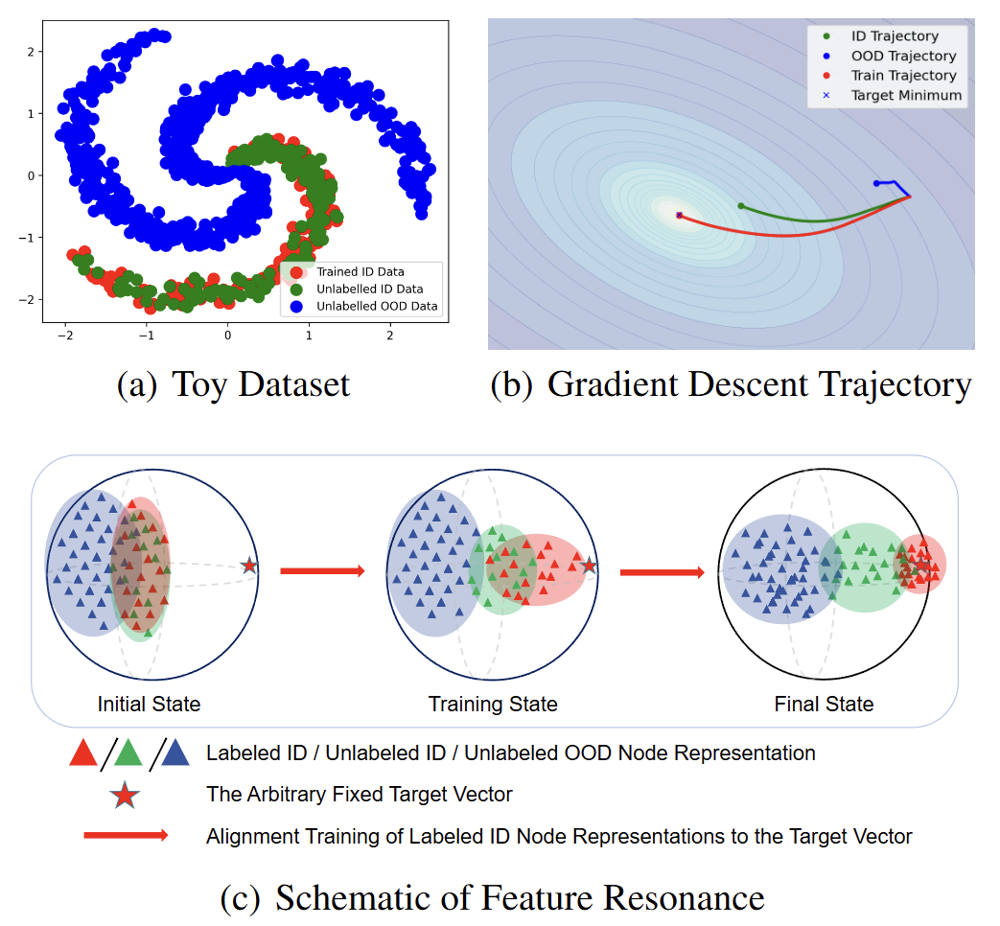

<div align="center">


</div>

# 📖Introduction

Out-of-distribution (OOD) node detection in graphs is a critical yet challenging task. Most existing approaches rely heavily on fine-grained labeled data to obtain a pre-trained supervised classifier, inherently assuming the existence of a well-defined pretext classification task. However, when such a task is ill-defined or absent, their applicability becomes severely limited. To overcome this limitation, there is an urgent need to propose a more scalable OOD detection method that is independent of both pretext tasks and label supervision. We harness a new phenomenon called **Feature Resonance**, focusing on the feature space rather than the label space. We observe that, ideally, during the optimization of known ID samples, unknown ID samples undergo more significant representation changes than OOD samples, even when the model is trained to align arbitrary targets.
The rationale behind it is that even without gold labels, the local manifold may still exhibit smooth resonance.  Based on this, we further develop a novel graph OOD framework, dubbed **R**esonance-based **S**eparation and **L**earning (**RSL**), which comprises two core modules:  (i)-a more practical micro-level proxy of feature resonance that measures the movement of feature vectors in one training step. (ii)-integrate with a synthetic OOD node strategy to train an effective OOD classifier. The link to the paper is as follows: https://arxiv.org/abs/2502.16076





---

# ✨Getting Started

## Installation

You can install RSL dependencies by running the following commands:
```bash
conda create -n RSL python=3.10
conda activate RSL
pip install -r requirements.txt
bash run.sh
```


# 📬 Contact

For questions, feedback, or collaboration opportunities, feel free to reach out:
- Shenzhi Yang: yangshenzhi@zju.edu.cn

# Citation
If you find our work useful, please kindly cite our paper.
```bib
@misc{yang2025harnessingfeatureresonancearbitrary,
      title={Harnessing Feature Resonance under Arbitrary Target Alignment for Out-of-Distribution Node Detection}, 
      author={Shenzhi Yang and Junbo Zhao and Sharon Li and Shouqing Yang and Dingyu Yang and Xiaofang Zhang and Haobo Wang},
      year={2025},
      eprint={2502.16076},
      archivePrefix={arXiv},
      primaryClass={cs.LG},
      url={https://arxiv.org/abs/2502.16076}, 
}
```
